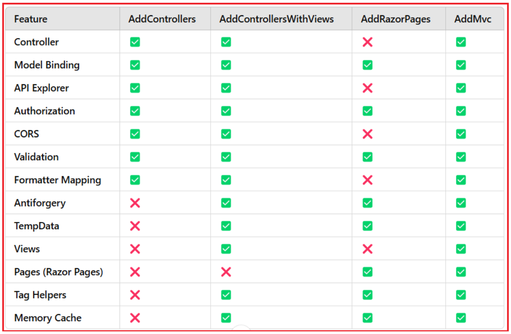

    <ItemGroup>
        <FrameworkReference Include="Microsoft.AspNetCore.App" />
    </ItemGroup>

# MVC Builder

In ASP.NET Core, we can configure the MVC (Model-View-Controller) and Razor Pages services by calling methods such as AddControllers(), AddMvc(), AddControllersWithViews(), and AddRazorPages() on the IServiceCollection. When building an ASP.NET Core application, choosing the right service configuration method is crucial for optimizing functionality and performance.

These methods are implemented as extension methods on the IServiceCollection interface, which is used to register services in the ASP.NET Core dependency injection container. They are available with two overloads:

* Without parameters: Registers default services.
* With a parameterized Options object: Allows customization of the registered services.

## Features of All Available Methods

Controller: Controllers are essential for handling incoming HTTP requests, processing them, and returning appropriate responses in MVC and Web API applications.

Model Binding: Model Binding is a fundamental feature that maps incoming HTTP request data (such as route data, query strings, form data, and JSON bodies) to action method parameters or Razor Page models.

API Explorer: API Explorer provides metadata about your application’s API endpoints, facilitating the generation of documentation (like Swagger) and enabling tools to discover available APIs. It includes details such as controller actions, HTTP methods, routes, parameters, and response types.

Authorization: Authorization ensures that users have the necessary permissions to access specific resources or perform certain actions within your application.

CORS (Cross-Origin Resource Sharing): CORS enables your application to handle requests from different origins, which is essential for scenarios like accessing APIs from client-side applications hosted on different domains.

Validation: Validation ensures that incoming data adheres to defined rules before processing. Using DataAnnotations or Fluent Validation, ASP.NET Core can enforce data integrity and business rules.

Formatter Mapping: Formatter Mapping determines how the response data is serialized, such as JSON or XML formatting. This feature is crucial for APIs that need to return data in specific formats.

Antiforgery: Antiforgery tokens protect your application against Cross-Site Request Forgery (CSRF) attacks by ensuring that form submissions originate from trusted sources.

Temp Data: TempData allows us to store data temporarily, persisting it across a single redirect. This is particularly useful for scenarios like passing messages between actions or pages.

Views: Views are the user interface components that render HTML to the client, typically using Razor syntax. This feature is essential for MVC web applications that follow the Model-View-Controller pattern.

Pages: Razor Pages offers a simplified, page-centric approach to building web applications, where each page handles its own model and actions. This feature promotes cleaner and more maintainable code for scenarios that don’t require the full MVC pattern.

Tag Helpers: Tag Helpers enable server-side code to dynamically generate and manipulate HTML elements, enhancing the integration between HTML and C# code. This feature is particularly beneficial for creating reusable and maintainable UI components.

Memory Cache: Memory Cache allows your application to store frequently accessed data in memory, significantly improving performance by reducing the need for repeated data retrieval operations.

## Which Method to Use in Our Application?

For Web API Applications (RESTful Services): Use AddControllers(). Provides the necessary features for API development without the overhead of views or Razor Pages.

For MVC Web Applications: Use AddControllersWithViews(). Supports both controllers and views, aligning with the traditional MVC pattern.

For Razor Pages Applications: Use AddRazorPages(). Designed for page-focused development without the need for controllers or views.

For Mixed Applications (MVC + Razor Pages): Use AddMvc(). Combines the capabilities of both MVC and Razor Pages, offering maximum flexibility at the cost of including all related features. The AddMvc method has all the features. You can use the AddMVC method with any application (Web API, MVC, and Razor Pages). Adding the AddMvc() method will add extra features even though they are not required for your application, which might impact the performance of your application. Always choose the most specific service configuration method that aligns with your application’s requirements to optimize performance and maintain clarity in your application’s architecture.

# References

* https://dotnettutorials.net/lesson/difference-between-addmvc-and-addmvccore-method/