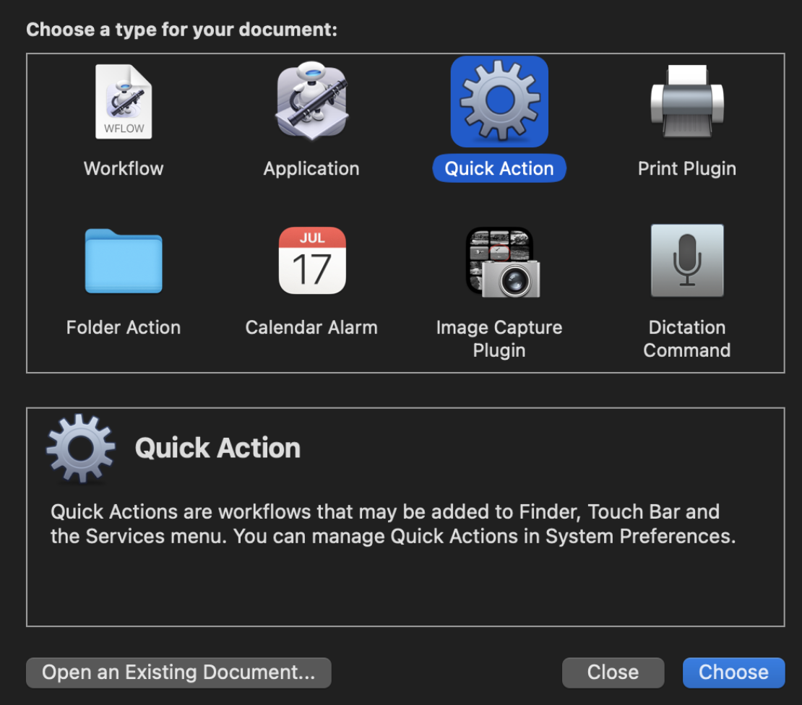
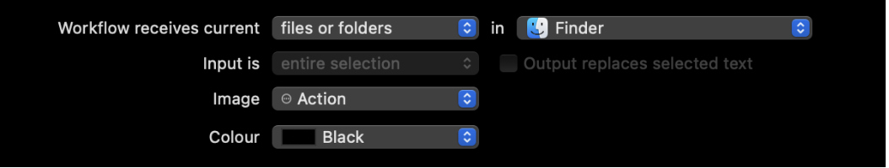
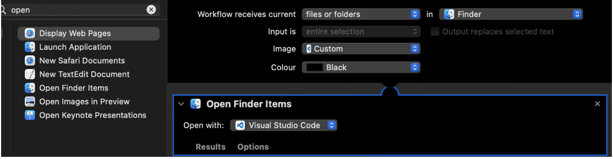
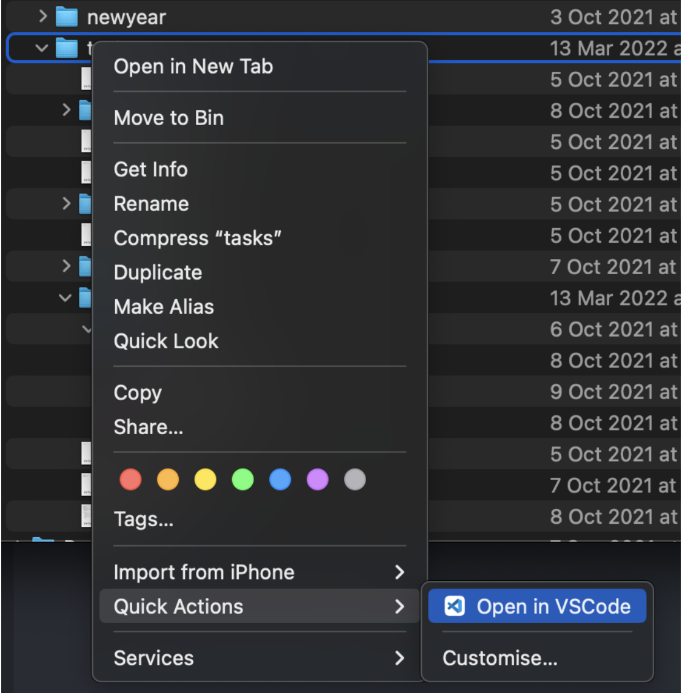

# Open a File or Folder in VSCode using Qucik Actions
       
1. Launch Automator and select Quick Action or File > New > Quick Action If Automator is already open.

2. Set Quick Action receives selected to files or folders and in to Finder. 

3. Choose an Image (icon) select Choose.. and double click Visual Studio Code in the window that pops up, this will set your quick action icon to the same as VS Code

4. On the left-hand side where you see all the available items to add to your automation go into the search bar and type open, next choose Open Finder Items (you can either double click it or drag it to your workflow).

5. In the Open Finder Items section choose open with select Other.. then from the popup list select Visual Studio Code. Please see the screenshot below.

6. Finally, just hit CMD+S to save and name it Open in VSCode

Here is your final result: 

